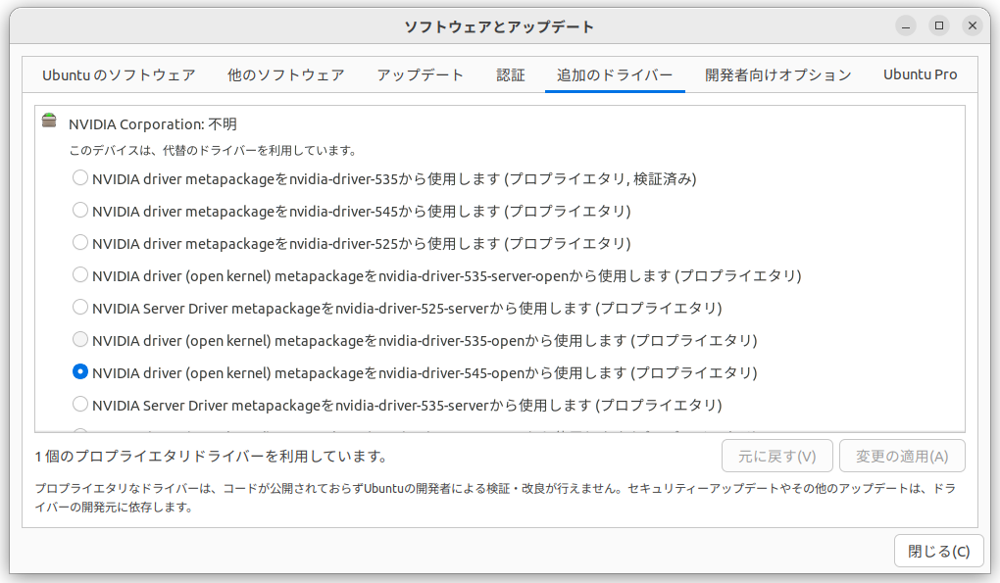

# For Ubuntu
---
## Setup menu
### Shell setup
- [Install zsh](README.md#install-zsh)
### Homebrew setup
- [Install HomeBrew](README.md#install-homebrew)
### Terminal Tools setup
- [Install Terminal Tools](README.md#install-treminal-tools)
### Setting up Secure Boot
- [Setting up Secure Boot](README.md#setting-up-secure-boot-1)
### Deep learning setup
- [Deep learning setup](README.md#deep-learning-setup-1)
### CPU Cooler setup
- [CPU Cooler setup](README.md#cpu-cooler-setup-1)
---
Ubuntu22.04LTSで深層学習をするためのセットアップです。  
ワークステーションの仕様は以下の通り。
|項目|詳細|
|-|-|
|CPU|intel i7 13700K|
|GPU|nVidia RTX4070Ti 12GB|
|coolor|NZXT kraken240|
|memory|128GB|
|storage 1|Ubuntu(1TB)|
|storage 2|Windows(1TB)|
|storage 3|share storage(2TB)|


---
## Install zsh
Bashよりカスタムしやすいので、Shellはzshを使います。
```
sudo apt install zsh
chsh -s $(which zsh)  
```
**Make sure to reboot!**  
```
sudo reboot
```

  
## Install HomeBrew
いくつかのツールはHomeBrew経由で入手するので、セットアップします。  
依存関係をインストール後に、HomeBrewのインストールスクリプトを実行します。
- Installing HomeBrew dependencies  
```
sudo apt install build-essential procps curl file git
```
- install homebrew
```
/bin/bash -c "$(curl -fsSL https://raw.githubusercontent.com/Homebrew/install/HEAD/install.sh)"  
(echo; echo 'eval "$(/home/linuxbrew/.linuxbrew/bin/brew shellenv)"') >> /home/**user_name**/.zprofile
eval "$(/home/linuxbrew/.linuxbrew/bin/brew shellenv)"
```
**Make sure to reboot!**
```
sudo reboot
```
---
## Install Treminal Tools
CLIを使う上で便利なツールをインストールします。

### From HomeBrew
- #### GCC, GH  and GHQ install  
  ```
  brew install ghq gcc gh
  ```
### From apt
- #### FZF ,TREE and BAT install  
  ```
  sudo apt install fzf tree bat
  ```
- ### From cargo
  ```
  curl https://sh.rustup.rs -sSf | sh

  ```
  ```
  cargo install lsd

  ```
### Install Zsh plugin maneger
- #### Zinit 
  ```
  bash -c "$(curl --fail --show-error --silent --location https://raw.githubusercontent.com/zdharma-continuum/zinit/HEAD/scripts/install.sh)"  
  ```
- #### Font Hack gen nerd font install  
  ターミナルで使うフォントは、hack gen nerd fontを使います。  
  https://github.com/yuru7/HackGen  
  ダウンロード後は、フォントマネージャなどでインストールしてください。

- #### clone enhancd  
  ```
  ghq get https://github.com/b4b4r07/enhancd.git
  ```
### .zshrc
- Download "zshrc_for_ubuntu" and replace it with ".zshrc".


### Configure p10K
- PowerLineの設定を、以下のコマンドで行います。
  ```
  p10k configure
  ```

### snap setup
- snapもセットアップしておく。
  - neovim
  - mpv
  - vlc
- ↑をインストールしておく。

### flatpak setup
- flathubもセットアップしておく。nVidia Driverが更新できるっぽい？
### NeoVim setup
- LazyVimを使う。
- https://github.com/LazyVim/LazyVim
- ColorschemeはSolarized osakaを使う。
- https://github.com/craftzdog/solarized-osaka.nvim

---
## Setting up Secure Boot
Windows11とデュアルブート環境を作成しているので、UEFIのセットアップ画面でセキュアブートを有効化しておく。  
セキュアブートを無効化したままだと、WindowsUpdateができなくなる可能性があるので注意が必要。  
セキュアブートを有効化してUbuntuを起動すると、サードパーティー製のドライバーが読み込めないので、読み込めるように署名を作成して必要なキーを登録する必要がある。
- セキュアブートを有効化する場合は、以下の設定を行う
  1. 署名キーを作成する  
      ```
      openssl req -new -x509 -newkey rsa:2048 -keyout MOK.priv -outform DER -out MOK.der -nodes -days 36500 -subj "/CN=Descriptive name/"
      ```
  2.  モジュールに署名する  
      ```
      sudo /usr/src/linux-headers-$(uname -r)/scripts/sign-file sha256 ./MOK.priv ./MOK.der <</path/to/module>>
      ```
      <</path/to/module>>は、以下のコマンドで表示されたパスで置き換える
      ```
      modinfo -n nvidia
      ```
      以下のコマンドが置き換えたコマンドになる
      ```
      sudo /usr/src/linux-headers-$(uname -r)/scripts/sign-file sha256 ./MOK.priv ./MOK.der $(modinfo -n nvidia)
      ```
  3.  セキュアブートにキーを登録する
      ```
      sudo mokutil --import MOK.der
      ```
      このときパスワードの設定を求められる。セキュアブートキー登録に関するパスワードになる。覚えておく。  
      再起動すると以下の画面になるのでキーを登録する  
      選択肢は以下の通りでOK  
          1.  Enroll MOK  
          2.  Continue  
          3.  Yes  
          4.  設定したパスワードを入力  
          5.  OK  
  
  1. もう一度再起動が行われる
  2. Ubuntuのアップデートなどで↑の画面が表示された場合、再度登録する必要がある。nvidia-smiをして使えないことを確認した後に、iiとiiiを行って再起動させる
  3. 間違って何もせずにUbuntuを起動してしまったときは
      ```
      sudo mokutil --disable-validation
      ```
      で再度一時的なパスを入力して再起動  
  4.  セキュアブートをONにする画面は  
      ```
      sudo mokutil --enable-validation
      ```
---
## Waylandを有効にしたい場合（デフォルトは無効）  
- nVidiaGPU搭載でUbuntuをセットアップした場合、デフォルトでWaylandが無効化されている（22.04LTS）。
- Xorgで問題ないが、どうしてもWaylandを使う場合は以下の手順を行う。
- nVidia driver 510以降で対応しているらしい  
```/etc/gdm3/custom.conf```  
  をテキストエディタで開き、WaylandEnableの項目をfalse -> trueに変更する。
- 再起動して、ログインユーザー選択画面でユーザーを選択後、パスワードを入力せずに画面右下の歯車アイコンをクリックする。 下のメニューからubuntu on waylandを選択すると利用できる 
  ```
  ubuntu
  ubuntu on wayland <- これを選ぶ
  ```
---
## Deep learning setup
Ubuntuのセットアップ時には、プロプライエタリドライバーを使わずにセットアップする。  
セットアップ時にプロプライエタリドライバーを使うようにしたら、セットアップ後にドライバーの変更ができない症状が出たので・・・  
ドライバーとCUDA Tool Kitのバージョンは、セットで考える  
ドライバーとnVidia CUDA Compiler(nvcc)のバージョンを合わせないとトラブルになる  
古いCUDAをCondaでセットアップする場合でも、ドライバーにあったnvccが必要なので、OS側にCUDAをセットアップする場合は、ドライバーに対応したCUDA Tool Kitを入れる  
Open-kernelに関しては、GPU Direct Storageが利用可能で、学習効率が上がるらしい・・・別途セットアップが必要、ここではセットアップしない。  


### Ubuntu 22.04 LTS
#### Driver setup
- Ubuntuのセットアップ時には、プロプライエタリドライバーを使わない。
- Ubuntuのソフトウェアとアップデート→追加のドライバーから簡単にセットアップできる。
- 選択して変更の適応を押した後、ドライバーのダウンロードなどがバックグラウンドで処理されるので、しばらく待つ。
  
- ドライバーのバージョンは、GPUの種類とCUDAのバージョンに合うものを入れる
- RTX4070Ti(12GB)の場合、CUDA12.3では、nvidia-driver-545もしくはnvidia-driver-545-openをセットアップ
- open-kernelは、新機能を利用可能。どちらでもOK。
- zlibのインストール
- ```sudo apt-get install zlib1g```
- もし、ソフトウェアとアップデートで選択できない場合は、
   - nVidiaドライバーを一旦削除する。
  - ```sudo apt-get --purge remove "*nvidia*" "libxnvctrl*"```
  - ```sudo apt-get autoremove```
  - 改めて、ｎVidiaのドライバーをセットアップする。
#### CUDA setup
- Conda側でセットアップする場合はスキップ可
- OS側にセットアップする場合
  - ↓がセットアップのドキュメント
  - https://docs.nvidia.com/cuda/cuda-installation-guide-linux/index.html?utm_source=pocket_saves
  - 予め、古いapt-keyを削除しておく  
    ```sudo apt-key del 7fa2af80```
  - 次に、↓からDownLoad nowをおしてダウンロード画面へ行く
  - https://developer.nvidia.com/cuda-toolkit
  - OSなどインストールする項目を選択してく
  - Download Installer for Linux Ubuntu 22.04 x86_64のBase Installerに表示されるコードを実行していく
  - .bashrcもしくは.zshrcに以下を追加する
    ```
    # <<<CUDA setting>>>
    export CUDA_PATH=/usr/local/cuda
    export LD_LIBRARY_PATH=/usr/local/cuda/lib64:${LD_LIBRARY_PATH}
    export PATH=/usr/local/cuda/bin:${PATH}
    ```

- Driver Installerは、すでに対応ドライバーがインストールされている場合はスキップする
- CUDAが要求するバージョンのセットアップ情報が記載されているので、インストールされているバージョンが異なる場合は、記載されているドライバーへ更新する。
- アップデートするときは、一旦削除しておく
  - CUDAをアンインストールする場合は以下  
    ```
    sudo apt-get --purge remove "*cuda*" "*cublas*" "*cufft*" "*cufile*" "*curand*"
    \ "*cusolver*" "*cusparse*" "*gds-tools*" "*npp*" "*nvjpeg*" "nsight*" "*nvvm*"
    ```
#### Conda setup
- miniforge3を使う
- https://github.com/conda-forge/miniforge
- Unix-like platforms (Mac OS & Linux)に従ってインストールする
  ```
  curl -L -O "https://github.com/conda-forge/miniforge/releases/latest/download/Miniforge3-$(uname)-$(uname -m).sh"
  bash Miniforge3-$(uname)-$(uname -m).sh
  ```
- zshの場合、initializeされていない場合があるので、その時は以下を実行する
  ```
  conda init zsh
  ```
- condaチャンネルを追加する。nvidiaとanacondaチャンネルを追加する
  ```
  conda config --append channels nvidia
  conda config --append channels anaconda
  ```
#### Tensorflow setup
Condaを使って、異なるバージョンを環境ごとにセットアップする  
※2024年1月29日現在、CUDAの最新バージョンは12.3.2
- Tensorflow2.15以降  
Tensorflow2.15以降は、CUDA12.xに移行している  
  - CUDAのインストール(OS側にインストールしている場合はスキップ可)
    - Nvidia CUDA compiler（nvcc）が必要なのでいれる。（ドライバーが対応しているバージョンを入れること）
    - ```conda install cuda -c nvidia```
    - nvccが入ったかどうかを```nvcc --version```を実行して確認する。
  - TensorflowとCUDAに必要な諸々をインストール(依存関係やcuDnnなどもインストールされる)
    - ```pip install 'tensorflow[and-cuda]'```
  - TensorRT（必要ならTensorRTもインストール）
    - ```pip install --extra-index-url https://pypi.nvidia.com tensorrt-bindings==8.6.1 tensorrt-libs==8.6.1```  

- Tensorflow2.14以前の場合  
DeepLabCutなど2.13以前のTensorflowが必要な場合は、CUDA11.xが必要  
CondaからCUDA11.8の依存関係をセットアップしてくれるパッケージがあるのでそれを活用する  
Condaで配布されているCUDA付きのパッケージを入れると、CUDA関係の依存関係がインストールされる  
  - CUDAのインストール(OS側にインストールしている場合はスキップ可)
    - Nvidia CUDA compiler（nvcc）が必要なのでいれる。（ドライバーが対応しているバージョンを入れること、Tensorflowではなく、ドライバー側の対応バージョンを入れる）
    - ```conda install cuda -c nvidia```
    - nvccが入ったかどうかを```nvcc --version```を実行して確認する。
  - TensorflowとCUDAに必要な諸々をインストール（依存関係やcuDnnなどもインストールされる、ここでTensorflowに必要なCUDAの依存関係がインストールされる）
    - ```conda search tensorflow```  
    検索に出た一覧の中からcudaのパッケージを選んでインストールする  
    例）  

      |Name|Version|Build|Channel|
      |-|-|-|-|
      |tensorflow|2.12.1|cuda112py39h9864e96_1|conda-forge|

    Build情報の```cuda112py39h9864e96_1 ```をtensorflowのバージョンの後に指定することで依存関係を含めてインストールできる
    - ```conda install tensorflow=<<<version>>>=<<<build>>> -c <<<channel>>>```  
      ↑の形式に当てはめる感じで↓のコマンドでインストールできる
    - ```conda install tensorflow=2.12.1=cuda112py39h9864e96_1 -c conda-forge```  
      で指定したTensorflowのバージョンとその依存関係がインストールできる
    - TensrRTの互換性に注意。
  - tensorflow実行時にNUMA nodeの警告が出る場合
    - GPUを確認する
      ```lspci | grep -i nvidia```
    - VGAの番号があるかを確認
      ```ls /sys/bus/pci/devices/```
    - numa node の状態を確認　-1の場合無効になっている
      ```cat /sys/bus/pci/devices/0000\:01\:00.0/numa_node```
    - NUMA NODE を有効化する  
      ```sudo echo 0 | sudo tee -a /sys/bus/pci/devices/0000\:01\:00.0/numa_node```
    - 有効になったかを確認  
      ```cat /sys/bus/pci/devices/0000\:01\:00.0/numa_node```  
    - systemdでサービス化する  
      ```/etc/systemd/system/vga_numa_connect.service```  
      ↑のファイルを作成する
    - 中身
      ```
      [Unit]
      Description=vga_numa_connect command

      [Service]
      ExecStart=/bin/bash -c 'echo 0 | sudo tee -a /sys/bus/pci/devices/0000:01:00.0/numa_node'

      [Install]
      WantedBy=default.target
      ```
    - 有効化
      ```
      sudo systemctl enable vga_numa_connect.service
      sudo systemctl start vga_numa_connect.service
      ```
  - ↓のエラーが表示される場合、layout_optimizerをオフにする。 Tensorflow(2.15 post1)の不具合かもしれない 
    ```
    layout failed: INVALID_ARGUMENT: Size of values 0 does not match size of permutation 4 @ fanin shape inmodel/***/dropout/SelectV2-2-TransposeNHWCToNCHW-LayoutOptimizer
    ```
    - 学習コードに以下を追加してオプション指定でモデルをコンパイルする
      ```
      import contextlib

      @contextlib.contextmanager
      def options(options):
          old_opts = tf.config.optimizer.get_experimental_options()
          tf.config.optimizer.set_experimental_options(options)
          try:
              yield
          finally:
              tf.config.optimizer.set_experimental_options(old_opts)
      
      ```
      ```
      with options({"layout_optimizer": False}):
          model.compile(
              loss=LOSS,
              optimizer=OPTIMIZER,
              metrics=["accuracy"],
              # jit_compile=True
          )
      ```


#### Ultralytics YOLOv8 setup
  - ```pip install ultralytics```
  - PyTrochのCUDAバージョンに注意。現行のCUDAバージョンの場合は、そのままでOK。
  - 古いバージョンのCUDAを使う場合は、専用のインストールスクリプトでインストールする。
  - https://pytorch.org/get-started/locally/ ここから古いCUDA用のインストールスクリプトを取得する
  - TensrflowのCUDAを合わせること。
  
#### rembg setup
  - ```pip install 'rembg[gpu]'```
  - ```pip uninstall onnxruntime```
  - ```pip install -U --force-reinstall onnxruntime-gpu```
  - onnxruntimeは、一度アンインストールしてからgpuバージョンを再インストールしないと、CUDAのEPが使えなかった。
---
### CPU Cooler setup
NZXT kraken 240の制御をUbuntuで行いたかったので、liquidctlをセットアップする。  
[Cooler control](https://gitlab.com/coolercontrol/coolercontrol)が対応してくれれば、乗り換えたい。
### liquidctl setup
- https://github.com/liquidctl/liquidctl
- git versionで実験的に対応済みなので、gitの最新スナップショットをインストールする。
  ```
  # the latest snapshot of the official source code repository (requires git)
  python -m pip install git+https://github.com/liquidctl/liquidctl#egg=liquidctl
  ```
- /etc/udev/rules.dの中に[71-liquidctl.rules](https://github.com/liquidctl/liquidctl/blob/main/extra/linux/71-liquidctl.rules)を作成する。
- systemdに登録してサービス化する。
- ```/etc/systemd/system/liquidcfg.service```
- liquidcfg.serviceの例
  ```
  [Unit]
  Description=AIO startup service

  [Service]
  Type=oneshot
  ExecStart=/home/<<<ユーザー名>>>/miniforge3/bin/liquidctl initialize all
  ExecStart=/home/<<<ユーザー名>>>/miniforge3/bin/liquidctl set pump speed  25 30  30 50  35 75  40 100
  ExecStart=/home/<<<ユーザー名>>>/miniforge3/bin/liquidctl set fan speed 25 40  30 60  34 90  38 100

  [Install]
  WantedBy=default.target
  ```
- systemctlの自動実行設定をする
  ```
  systemctl daemon-reload
  systemctl start liquidcfg
  systemctl enable liquidcfg
  ```
  ---