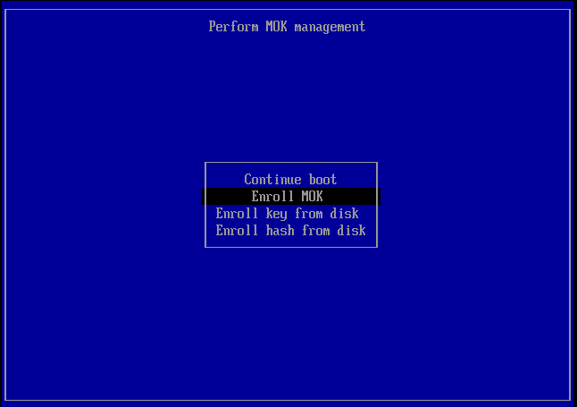

# For Ubuntu
---
Please execute in order from the top.  
---
## Install zsh
```
sudo apt install zsh
chsh -s $(which zsh)  
```
#### Make sure to reboot!

## Installing HomeBrew dependencies  
```
sudo apt install build-essential procps curl file git
```
  
## Install HomeBrew
```
/bin/bash -c "$(curl -fsSL https://raw.githubusercontent.com/Homebrew/install/HEAD/install.sh)"  
(echo; echo 'eval "$(/home/linuxbrew/.linuxbrew/bin/brew shellenv)"') >> /home/**user_name**/.zprofile
eval "$(/home/linuxbrew/.linuxbrew/bin/brew shellenv)"
```
#### Make sure to reboot!
---
## Install Treminal Tools
### From HomeBrew
#### GCC, GH  and GHQ install  
```
brew install ghq gcc gh
```
### From apt
#### FZF ,TREE and BAT install  
```
sudo apt install fzf tree bat
```
### From cargo
```
curl https://sh.rustup.rs -sSf | sh

```
```
cargo install lsd

```
### Install Zsh plugin maneger
#### Zinit 
```
bash -c "$(curl --fail --show-error --silent --location https://raw.githubusercontent.com/zdharma-continuum/zinit/HEAD/scripts/install.sh)"  
```
#### Font Hack gen nerd font install  
```
https://github.com/yuru7/HackGen  
```
Download it and install it with a font manager or something.  

#### clone enhancd  
```
ghq get https://github.com/b4b4r07/enhancd.git
```
### .zshrc
Download "zshrc_for_ubuntu" and replace it with ".zshrc".


### Configure p10K
```
p10k configure
```

## Setting up Secure Boot
- セキュアブートを有効化する場合は、以下の設定を行う
  1. 署名キーを作成する  
      ```
      openssl req -new -x509 -newkey rsa:2048 -keyout MOK.priv -outform DER -out MOK.der -nodes -days 36500 -subj "/CN=Descriptive name/"
      ```
  2.  モジュールに署名する  
      ```
      sudo /usr/src/linux-headers-$(uname -r)/scripts/sign-file sha256 ./MOK.priv ./MOK.der <</path/to/module>>
      ```
      <</path/to/module>>は、以下のコマンドで表示されたパスで置き換える
      ```
      modinfo -n nvidia
      ```
      以下のコマンドが置き換えたコマンドになる
      ```
      sudo /usr/src/linux-headers-$(uname -r)/scripts/sign-file sha256 ./MOK.priv ./MOK.der $(modinfo -n nvidia)
      ```
  3.  セキュアブートにキーを登録する
      ```
      sudo mokutil --import MOK.der
      ```
      このときパスワードの設定を求められる。セキュアブートキー登録に関するパスワードになる。覚えておく。  
      再起動すると以下の画面になるのでキーを登録する  
      選択肢は以下の通りでOK  
          1.  Enroll MOK  
          2.  Continue  
          3.  Yes  
          4.  設定したパスワードを入力  
          5.  OK  
  
  1. もう一度再起動が行われる
  2. Ubuntuのアップデートなどで↑の画面が表示された場合、再度登録する必要がある。nvidia-smiをして使えないことを確認した後に、iiとiiiを行って再起動させる

## Deep learning setup
### Ubuntu 22.04 LTS
#### Driver setup
- Ubuntuのセットアップ時には、プロプライエタリドライバーを使わない。
- Ubuntuセットアップ後にnVidiaドライバーを一旦削除する。
- ```sudo apt-get --purge remove "*nvidia*" "libxnvctrl*"```
- ```sudo apt-get autoremove```
- 改めて、ｎVidiaのドライバーをセットアップする。
- ドラーバーのバージョンは、GPUの種類とCUDAのバージョンに合うものを入れる
- RTX4070Ti(12GB)の場合は、nvidia-driver-545をセットアップ
- open-kernelは、新機能を利用可能。ただGPU使用率が低いかも（要検証）？
#### CUDA setup
- Condaのみでセットアップした場合、警告メッセージが出てくるので、OS側にもセットアップしておく
  - ↓がセットアップのドキュメント
  - https://docs.nvidia.com/cuda/cuda-installation-guide-linux/index.html?utm_source=pocket_saves
  - 予め、古いapt-keyを削除しておく  
    ```sudo apt-key del 7fa2af80```
  - 次に、↓からDownLoad nowをおしてダウンロード画面へ行く
  - https://developer.nvidia.com/cuda-toolkit
  - OSなどインストールする項目を選択してく
  - Download Installer for Linux Ubuntu 22.04 x86_64のBase Installerに表示されるコードを実行していく
  - .bashrcもしくは.zshrcに以下を追加する
    ```
    # <<<CUDA setting>>>
    export CUDA_PATH=/usr/local/cuda
    export LD_LIBRARY_PATH=/usr/local/cuda/lib64:${LD_LIBRARY_PATH}
    export PATH=/usr/local/cuda/bin:${PATH}
    ```

- Driver Installerは、すでに対応ドライバーがインストールされている場合はスキップする
- アップデートするときは、一旦削除しておく
  - CUDAをアンインストールする場合は以下  
    ```
    sudo apt-get --purge remove "*cuda*" "*cublas*" "*cufft*" "*cufile*" "*curand*"
    \ "*cusolver*" "*cusparse*" "*gds-tools*" "*npp*" "*nvjpeg*" "nsight*" "*nvvm*"
    ```
#### Tensorflow setup
- CUDA12.xの環境と11.xの環境を両立させる
- Condaで環境を分ける
- 2.15〜CUDA12.x
- 2.15以降の場合
  - Tensorflow
    - ```pip install 'tensorflow[and-cuda]'```
  - TensorRT
    - ```pip install --extra-index-url https://pypi.nvidia.com tensorrt-bindings==8.6.1 tensorrt-libs==8.6.1```
- DeepLabCutなど2.13以前のTensorflowが必要な場合は、CUDA11.xが必要
- CondaからCUDAをセットアップしてくれるパッケージがあるのでそれを活用する
- 2.14以前の場合
  - Tensorflow
    - ```conda install tensorflow=2.12.*=cuda*```
  - TensrRTの互換性に注意。
  
#### Install Ultralytics
  - ```pip install ultralytics```
  - PyTrochのCUDAバージョンに注意。現行のCUDAバージョンの場合は、そのままでOK。
  - 古いバージョンのCUDAを使う場合は、専用のインストールスクリプトでインストールする。
  - TensrflowのCUDAを合わせること。
  
#### Install rembg
  - ```pip install 'rembg[gpu]'```
  - ```pip uninstall onnxruntime```
  - ```pip install -U --force-reinstall onnxruntime-gpu```
  - onnxruntimeは、一度アンインストールしてからgpuバージョンを再インストールしないと、CUDAのEPが使えなかった。

